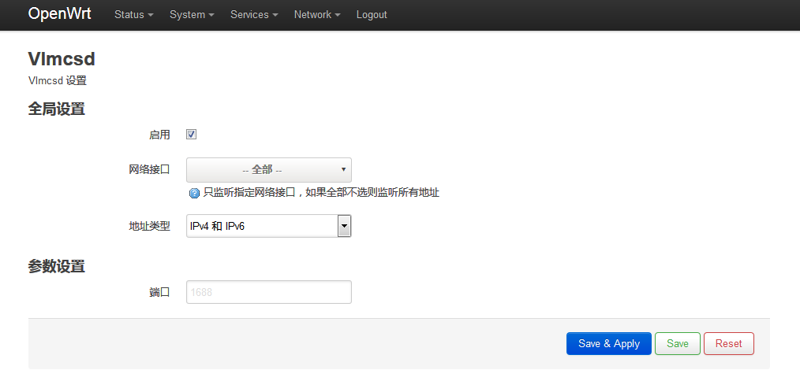
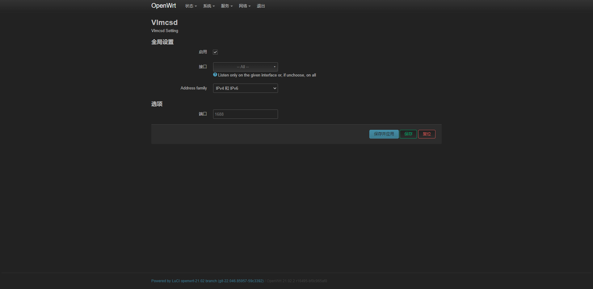

# luci-app-vlmcsd

谢谢 flytosky-f https://github.com/flytosky-f/luci-app-vlmcsd

优化模板html文件编码格式, 解决`openwrt 21.02.2`模板报错问题
需要配合flytosky-f的 [openwrt-vlmcsd](https://github.com/flytosky-f/openwrt-vlmcsd) 使用
- 编译方法：  
进入 openwrt sdk 目录，执行：
```
git clone https://github.com/ssuperh/luci-app-vlmcsd-new.git package/luci-app-vlmcsd-new
make menuconfig
make package/luci-app-vlmcsd/compile V=99
```
- 预览：


